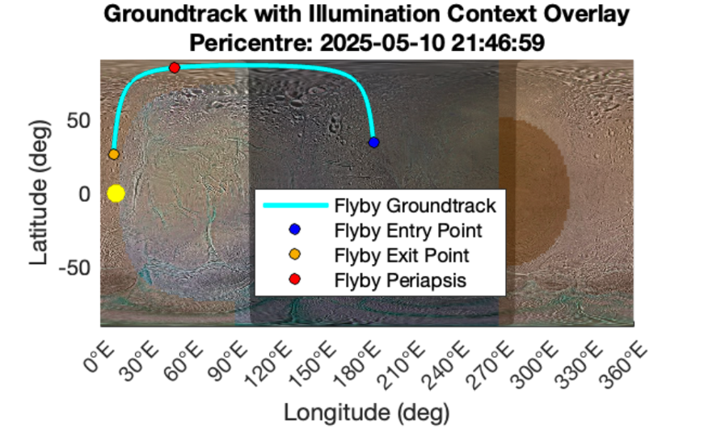
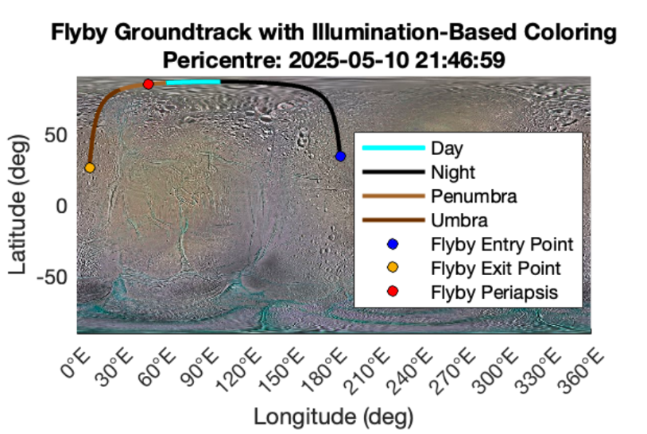
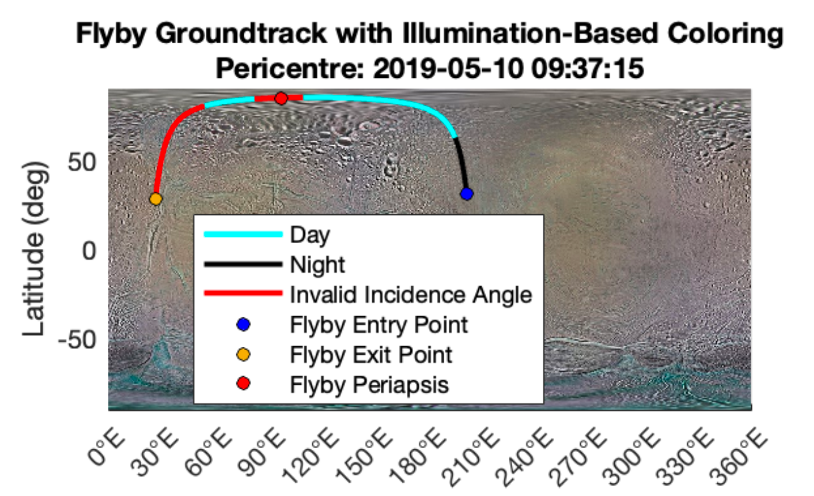
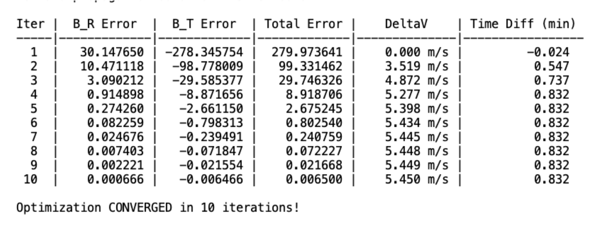
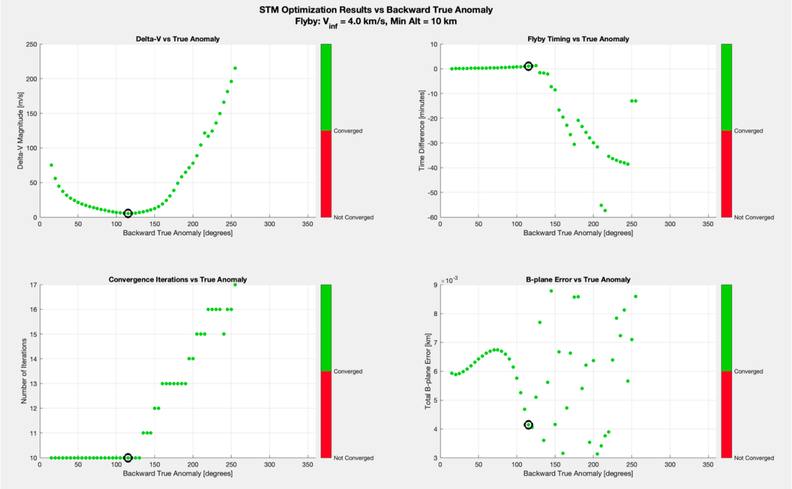
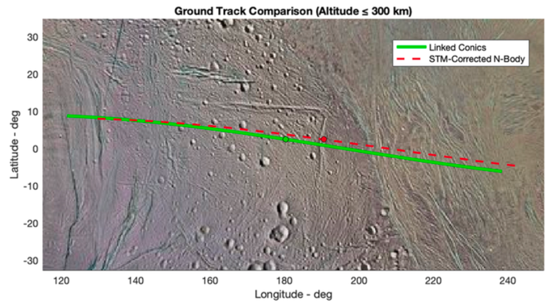
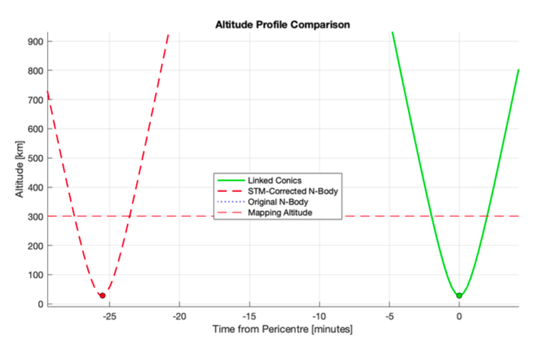

# Thesis code: High-Fidelity Illumination Modelling and N-Body Trajectory Optimisation for Enceladus Surface Groundtrack Design

## 📌 Abstract

This repository contains the MATLAB software developed for the Master's Thesis **["High-Fidelity Illumination Modelling and N-Body Trajectory Optimisation for Enceladus Surface Groundtrack Design"](pics/thesis.pdf)**, conducted within the framework of the **European Space Agency's (ESA) GIGANTES project** under the supervision of Prof. J.P. Sanchez-Cuartielles at ISAE SUPAERO.

This work extends the [GIGANTES repository](https://github.com/MacPau/GIGANTES-Repo) (see the README for a detailed description of the project aims and features). The thesis-specific algorithms and tools are located in the `refinements_development` directory.

### Context
Preliminary interplanetary mission design often relies on the linked-conics model, a computationally efficient but simplified approximation. However, this model faces significant limitations when transitioning to high-fidelity analysis, particularly for complex tours of Saturn's moons.

To address these challenges, this software suite implements two critical capabilities:

1.  **High-Fidelity Illumination:** A model that accurately predicts surface lighting conditions on Enceladus, incorporating both the terminator line and the frequent, long-lasting eclipses cast by an **oblate Saturn**. The model is validated against NASA’s SPICE toolkit with eclipse timing accurate to within one second.
2.  **N-Body Trajectory Optimisation:** A differential correction algorithm designed to bridge the gap between linked-conics and high-fidelity dynamics. By identifying principal perturbers (the Sun, Titan, and Saturn's $J_2$) and utilizing **State Transition Matrices (STM)** with **B-plane targeting**, the algorithm iteratively adjusts Trajectory Correction Manoeuvres (TCM) to ensure final groundtracks meet scientific objectives with minimal $\Delta V$.

## ☀️ High-Fidelity Illumination
This module computes and visualizes the illumination of groundtracks on Enceladus. It offers three visualization modes:

**1. Global Surface Projection**
For single flyby analysis, the tool can texture the entire surface of Enceladus based on the illumination conditions at the exact epoch of periapsis.

  

**2. Groundtrack Coloring**
For sequences involving multiple groundtracks, it is more effective to map the illumination status directly onto the trajectory path.

  

**3. Incidence Angle Validation**
Mission requirements often constrain the solar incidence angle for mapping instruments. The tool features a validation mode that highlights invalid incidence angles (non-compliant segments) in red.

  

#### 🚀 Usage
To generate these visualizations, simply run the demo script:
[`refinements_development/illumination/DEMO_ILLUMINATION.m`](LINK_TO_FILE_HERE)

## 🪐 N-Body Trajectory Optimisation
This module computes and visualizes single flyby deltaV corrections on Enceladus.

  
  
<em>STM algorithm converging to the desired B-PLANE tartgeted flyby geometry</em>

In particular running the [`true_anomaly_parfor.m`](./refinements_development/ultimo_tentativo/true%20anomaly/true_anomaly_parfor.m) script given:
- a flyby geometry:
    - nodein = [pump_angle_in, crank_angle_in, v_infinity_in]
    - nodeout = [pump_angle_out, crank_angle_out, v_infinity_out]
- an epoch for the flyby pericentre

The scripts loops the STM B-PLANE flyby optimization algorithm trough different value of true anomaly. This is the true anomaly before the flyby pericentre that the trajectory correction manoeuvre(TCM) is applied to match the desired flyby geometry.

  
  
<em>STM B-Plane optmization for different values of backward true anomaly</em>

To visualize better a single value of true anomaly it is also possible to:

  
  
<em>1. Visualize a comparison of the groundtracks</em>

  
  
<em>2. Visualize a comparison of the altitude profiles(function of time) with the pericentres hilighted</em>

  
  
<em>3. Run an interactive visualization of the flyby with the original and corrected trajectories</em>

## ⚠️ Installation Requirements
This software requires [MICE (MATLAB Interface for CSPICE)](https://naif.jpl.nasa.gov/naif/toolkit_MATLAB.html), the MATLAB version of NASA's SPICE toolkit, to be installed and correctly added to the MATLAB path.

> **Note for Apple Silicon (M series) users:**  
> Installation on newer Mac chips is more complex. It is recommended to follow this [detailed installation guide](https://gist.github.com/dsavransky/fcccae8fef7c226a63b39093c9ea6772).